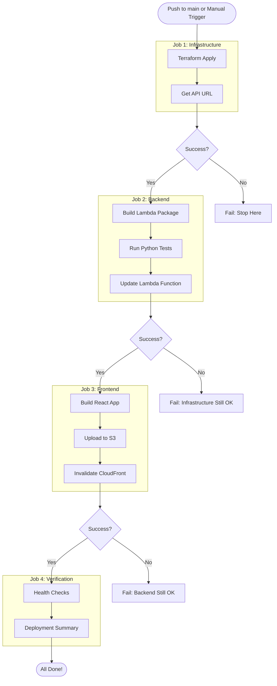

# Deployment Architecture

## Workflow Organization

```
.github/workflows/
├── deploy.yml                    ← MAIN WORKFLOW (use this!)
├── README.md                     ← Workflow documentation
└── modules/                      ← Individual components
    ├── terraform.yml             ← Infrastructure deployment
    ├── backend-deploy.yml        ← Backend/Lambda deployment
    ├── frontend-deploy.yml       ← Frontend/S3 deployment
    ├── README.md                 ← Module documentation
    └── USAGE.md                  ← Usage instructions
```

## Deployment Flow

### Main Workflow (deploy.yml)



## Sequential Execution

The deployment **must** happen in this order:

### Stage 1: Infrastructure (10-15 minutes)

**What it does:**
- Creates VPC with public/private subnets
- Launches RDS PostgreSQL database
- Sets up Lambda function configuration
- Creates API Gateway
- Creates S3 buckets
- Configures CloudFront distribution
- Sets up IAM roles and policies

**Output:**
- API Gateway URL
- S3 bucket names
- CloudFront distribution ID
- RDS endpoint

**Why first**: Everything else depends on this

### Stage 2: Backend (3-5 minutes)

**What it does:**
- Installs Python dependencies
- Runs test suite
- Builds Lambda deployment package
- Uploads to Lambda

**Depends on:**
- Lambda function (from Stage 1)
- RDS database (from Stage 1)
- S3 buckets (from Stage 1)

**Why second**: API must be available for frontend

### Stage 3: Frontend (2-3 minutes)

**What it does:**
- Installs Node dependencies
- Builds React application
- Uploads to S3
- Invalidates CloudFront cache

**Depends on:**
- S3 bucket (from Stage 1)
- CloudFront distribution (from Stage 1)
- API URL (from Stage 2)

**Why third**: Needs API to be ready

### Stage 4: Verification (< 1 minute)

**What it does:**
- Checks each stage status
- Runs health checks
- Generates deployment summary
- Reports any failures

**Output**: Deployment report with links

## Failure Handling

### If Infrastructure Fails

- **Impact**: Nothing deployed, safe to retry
- **Action**: Fix issue and re-run workflow
- **Rollback**: Not needed, nothing deployed

### If Backend Fails

- **Impact**: Infrastructure deployed, backend not updated
- **Action**: Fix backend code and re-run (only backend will deploy)
- **Rollback**: Infrastructure remains, no cleanup needed

### If Frontend Fails

- **Impact**: Infrastructure and backend deployed, frontend not updated
- **Action**: Fix frontend code and re-run (only frontend will deploy)
- **Rollback**: Backend API still works, can use API directly

### If Verification Fails

- **Impact**: Everything deployed but health checks failed
- **Action**: Investigate health check errors
- **Rollback**: Manual verification and fixes

## Selective Deployment

You can deploy individual components using workflow dispatch:

```yaml
Deploy Infrastructure: [ ] Yes  [✓] No
Deploy Backend:        [✓] Yes  [ ] No
Deploy Frontend:       [ ] Yes  [✓] No
```

This runs only the selected stages.

## Dependency Management

The workflow uses GitHub Actions `needs:` to enforce order:

```yaml
jobs:
  infrastructure:
    runs-on: ubuntu-latest
    # No dependencies, runs first
  
  backend:
    needs: infrastructure  # Waits for infrastructure
    if: needs.infrastructure.result == 'success'
  
  frontend:
    needs: [infrastructure, backend]  # Waits for both
    if: needs.backend.result == 'success'
  
  verify:
    needs: [infrastructure, backend, frontend]  # Waits for all
    if: always()  # Runs even if some failed
```

## Monitoring Deployment

### Real-Time Progress

In GitHub Actions, you'll see:

```
✅ 1. Deploy Infrastructure (completed in 12m 34s)
   ✅ Checkout code
   ✅ Configure AWS
   ✅ Terraform init
   ✅ Terraform plan
   ✅ Terraform apply
   ✅ Get outputs

✅ 2. Deploy Backend (completed in 4m 12s)
   ✅ Checkout code
   ✅ Set up Python
   ✅ Install dependencies
   ✅ Run tests
   ✅ Build Lambda package
   ✅ Update Lambda

✅ 3. Deploy Frontend (completed in 2m 45s)
   ✅ Checkout code
   ✅ Set up Node
   ✅ Install dependencies
   ✅ Build application
   ✅ Deploy to S3
   ✅ Invalidate CloudFront

✅ 4. Verify Deployment (completed in 0m 23s)
   ✅ Check status
   ✅ Health checks
   ✅ Summary

🎉 All deployments completed successfully!
```

### Deployment Summary

After completion, you'll see:

```
📊 Deployment Status Summary

- ✅ Infrastructure: Deployed
- ✅ Backend: Deployed
- ✅ Frontend: Deployed

🔗 Quick Links

- Frontend: https://xxxx.cloudfront.net
- API: https://xxxx.execute-api.us-east-1.amazonaws.com
- Clerk Dashboard: https://dashboard.clerk.com
```

## Advantages of Sequential Deployment

### ✅ Correct Order Guaranteed
- Infrastructure always deployed first
- Backend waits for infrastructure
- Frontend waits for backend

### ✅ Fail-Safe
- If infrastructure fails, nothing else runs
- If backend fails, infrastructure preserved
- If frontend fails, backend still works

### ✅ Time Efficient
- Skips unchanged components when possible
- Parallel execution within each stage
- Minimal wait time between stages

### ✅ Easy Rollback
- Each stage independent
- Can redeploy any stage individually
- Previous versions preserved

### ✅ Clear Visibility
- See exactly what's deploying
- Progress tracking for each stage
- Detailed logs for debugging

## Alternative: Independent Workflows

If you need to run workflows independently:

1. Copy workflow from `modules/` to `workflows/`
2. Trigger via GitHub Actions UI
3. Move back to `modules/` after use

Or use the main workflow with selective deployment options.

## Cost Optimization

The sequential deployment helps optimize costs:

- **Skip stages**: Don't redeploy infrastructure if unchanged
- **Fast feedback**: Fail fast if early stages have issues
- **No waste**: Don't build frontend if backend fails

## Security

Each stage uses:
- Secure secrets from GitHub
- AWS credentials with least privilege
- Terraform state locking
- No secrets in logs
- Encrypted environment variables

---

**Recommendation**: Always use the main `deploy.yml` workflow unless you have a specific reason to use individual workflows.
