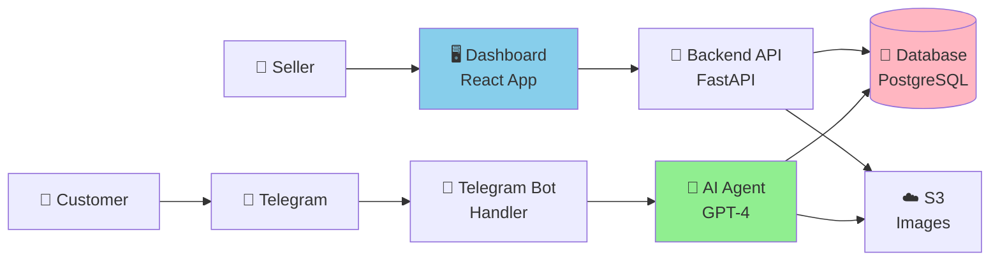

# Salesai - Project Overview

## What Is This?

An AI-powered sales assistant that handles customer conversations on Telegram 24/7, showing products, offering discounts, and processing orders automatically.

## For Sellers

### What You Get

1. **Dashboard**: Web app to manage products, discounts, and orders
2. **Telegram Bot**: AI agent that talks to customers when you're offline
3. **Smart Discounts**: Automatic discount calculations and offers
4. **Order Management**: Track all orders from one place
5. **Image Sharing**: Bot shows product images to customers

### How It Works

```
Your Dashboard → Add Products → AI Bot Learns → Customer Chats → Bot Sells → You Ship
```

**Example Conversation:**

```
Customer: "Do you have laptops?"
AI Bot: "Yes! We have a high-performance laptop for $999.99. 
        Would you like to see photos?"

Customer: "Yes"
AI Bot: [Sends product images]
       "This laptop has 16GB RAM and 512GB SSD. 
        If you buy 2, you get 10% off! How many would you like?"

Customer: "I'll take 2"
AI Bot: "Great! That's $1,799.98 with 10% discount (you save $200).
        What's your name and shipping address?"

Customer: [Provides info]
AI Bot: "Perfect! Your order #123 is confirmed. 
        The seller will ship it soon!"
```

You get a notification in your dashboard and ship the order!

## Technical Architecture



## Technology Stack

### Frontend (What Sellers See)
- **React** - Modern web framework
- **Tailwind CSS** - Beautiful styling
- **Clerk** - Secure authentication
- **Hosted on**: AWS S3 + CloudFront

### Backend (The Brain)
- **Python FastAPI** - Fast API framework
- **OpenAI GPT-4** - AI for conversations
- **PostgreSQL** - Database for products/orders
- **Hosted on**: AWS Lambda (serverless)

### Infrastructure (The Foundation)
- **AWS Lambda** - Serverless compute
- **RDS PostgreSQL** - Managed database
- **S3** - File storage
- **CloudFront** - Fast content delivery
- **Terraform** - Infrastructure as code

## Key Features

### 1. AI Agent Guardrails

The AI **only** discusses your products:

✅ Talks about your catalog
✅ Shows product images
✅ Calculates discounts
✅ Processes orders

❌ Won't discuss politics, news, or off-topic subjects
❌ Won't pretend to have products you don't sell
❌ Won't engage in general conversation

### 2. Flexible Discounts

Three types:
- **Percentage**: "10% off when buying 3+"
- **Fixed Amount**: "$20 off orders over $100"
- **Buy X Get Y**: "Buy 2 get 1 free"

The AI automatically applies the best discount!

### 3. Automated Deployment

One command deploys everything:
```bash
git push origin main
```

GitHub Actions handles:
1. Infrastructure setup
2. Backend deployment
3. Frontend deployment
4. Health checks

## Project Structure

```
salesai/
├── 📱 frontend/              # Seller dashboard (React)
│   ├── src/
│   │   ├── components/      # UI components
│   │   ├── pages/          # Dashboard pages
│   │   ├── lib/            # API client
│   │   └── types/          # TypeScript types
│   └── package.json
│
├── 🐍 backend/              # API & AI agent (Python)
│   ├── app/
│   │   ├── api/            # REST endpoints
│   │   ├── models/         # Database models
│   │   ├── services/       # AI agent, bot, discounts
│   │   └── main.py
│   ├── tests/              # Test suite
│   └── requirements.txt
│
├── 🏗️ terraform/            # AWS infrastructure
│   ├── main.tf
│   ├── vpc.tf
│   ├── rds.tf
│   ├── lambda.tf
│   ├── s3.tf
│   └── cloudfront.tf
│
├── 🚀 .github/workflows/    # Deployment automation
│   ├── deploy.yml          # Main workflow (sequential)
│   └── modules/            # Component workflows
│
└── 📚 Documentation
    ├── README.md           # Main docs
    ├── QUICKSTART.md       # 30-min setup guide
    ├── CLERK_SETUP.md      # Auth setup
    ├── AI_AGENT_GUIDE.md   # AI behavior guide
    └── More...
```

## Database Schema

```
┌─────────────┐
│    users    │ (Sellers)
├─────────────┤
│ id          │
│ clerk_id    │
│ email       │
│ username    │
│ business    │
│ bot_token   │
└──────┬──────┘
       │
       ├────────────────┐
       │                │
       ▼                ▼
┌─────────────┐  ┌─────────────┐
│  products   │  │    orders   │
├─────────────┤  ├─────────────┤
│ id          │  │ id          │
│ user_id     │  │ user_id     │
│ name        │  │ customer    │
│ price       │  │ items       │
│ images      │  │ total       │
│ stock       │  │ status      │
└──────┬──────┘  └─────────────┘
       │
       ▼
┌─────────────┐
│  discounts  │
├─────────────┤
│ id          │
│ product_id  │
│ type        │
│ threshold   │
│ value       │
└─────────────┘
```

## Cost Breakdown

Monthly AWS costs (typical usage):

| Service | Cost | Notes |
|---------|------|-------|
| RDS (db.t3.micro) | $15 | Database |
| Lambda | $5 | API + Bot (includes 1M free requests) |
| S3 | $1 | Storage |
| CloudFront | $1 | CDN |
| NAT Gateway | $32 | VPC networking |
| **Total** | **~$55/month** | Scales with usage |

Plus:
- **OpenAI**: Pay per API call (~$0.002 per conversation)
- **Clerk**: Free up to 10K users
- **Telegram**: Free

## Security Features

- **Authentication**: Clerk with 2FA support
- **Authorization**: Role-based access control
- **Data Encryption**: At rest (RDS, S3) and in transit (HTTPS)
- **Network**: RDS in private subnet
- **Secrets**: AWS Secrets Manager
- **API**: Rate limiting and input validation

## Scalability

### Automatic Scaling

- **Lambda**: Scales to thousands of concurrent requests
- **RDS**: Can upgrade to larger instances
- **CloudFront**: Global CDN, unlimited scale
- **S3**: Unlimited storage

### Performance

- **API Response**: < 200ms (without AI)
- **AI Response**: 2-5 seconds (OpenAI processing)
- **Image Load**: < 1s (via CloudFront CDN)
- **Database**: Connection pooling for efficiency

## Development Workflow

```
Local Development → Git Push → GitHub Actions → AWS Production
```

1. Make changes locally
2. Test locally (`npm run dev`, `uvicorn app:app`)
3. Run tests (`pytest`, `npm test`)
4. Commit and push
5. GitHub Actions deploys automatically
6. Monitor in Actions tab
7. Verify in production

## Getting Started

Choose your path:

### 🚀 Fast Track (30 minutes)
→ [QUICKSTART.md](QUICKSTART.md)

### 📖 Detailed Setup (1-2 hours)
→ [DEPLOYMENT_GUIDE.md](DEPLOYMENT_GUIDE.md)

### 🔧 Manual Setup (2-3 hours)
→ [DEPLOYMENT.md](DEPLOYMENT.md)

## Support & Documentation

| Topic | Document |
|-------|----------|
| Quick deployment | [QUICKSTART.md](QUICKSTART.md) |
| Automated deployment | [DEPLOYMENT_GUIDE.md](DEPLOYMENT_GUIDE.md) |
| Manual deployment | [DEPLOYMENT.md](DEPLOYMENT.md) |
| Clerk authentication | [CLERK_SETUP.md](CLERK_SETUP.md) |
| AI agent behavior | [AI_AGENT_GUIDE.md](AI_AGENT_GUIDE.md) |
| GitHub workflows | [.github/workflows/README.md](.github/workflows/README.md) |
| Contributing | [CONTRIBUTING.md](CONTRIBUTING.md) |

## FAQ

**Q: How much coding knowledge do I need?**
A: Basic git and command line. The deployment is mostly automated.

**Q: Can I customize the AI's personality?**
A: Yes! Edit the system prompt in `backend/app/services/ai_agent.py`

**Q: What if I don't have AWS experience?**
A: Follow the QUICKSTART guide step-by-step. It's designed for beginners.

**Q: Is it expensive to run?**
A: ~$55/month base cost + OpenAI usage (varies by traffic)

**Q: Can I use my own domain?**
A: Yes! Configure in Terraform variables and update CloudFront

**Q: How do I add more products?**
A: Log into dashboard, click Products → Add Product

**Q: Can customers pay through the bot?**
A: Not yet, but you can integrate Stripe/PayPal (see Future Enhancements)

**Q: Is my data secure?**
A: Yes! Uses industry-standard encryption and security practices

## Contributing

Want to improve the platform? See [CONTRIBUTING.md](CONTRIBUTING.md)

## License

MIT License - See [LICENSE](LICENSE) for details

---

Built with ❤️ for independent sellers and small businesses
